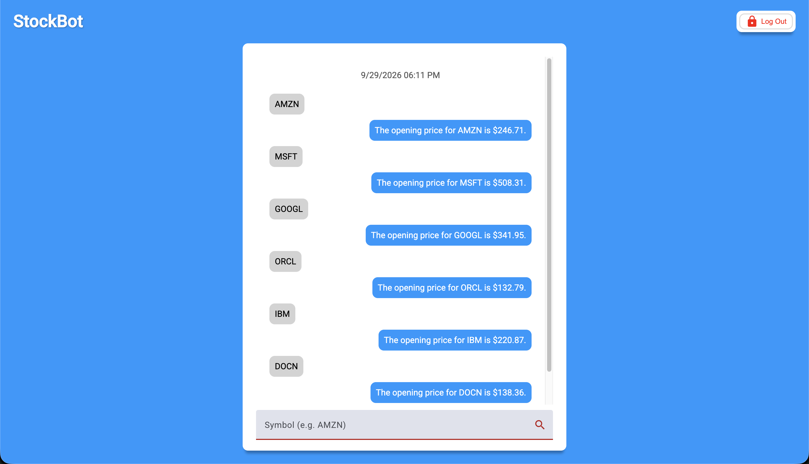

# StockBot



This project was generated using [Angular CLI](https://github.com/angular/angular-cli) version 19.2.27 and was built on Node.js v22.5.1 and MySQL 8.0.31.

## Start the server

To start the local server, run:

```
node --env-file=.env src/server/index.js
```

The development server stores secrets like the DB config, API URLs, and API keys in a .env file. For a production application, those should be stored in AWS Secrets Manager (or similar).

## Start the client

To start the local client, run:

```bash
ng serve --configuration=development
```

You can omit the `configuration` argument for local development.

Once the client is running, open your browser and navigate to `http://localhost:4200/`.

## Building

To build the project run:

```bash
ng build
```

This will compile the project and store the build artifacts in the `dist/` directory. By default, the production build optimizes the application for performance and speed.

## Running unit tests

To execute unit tests with the [Karma](https://karma-runner.github.io) test runner, use the following command:

```bash
ng test
```

## Running end-to-end tests

For end-to-end (e2e) testing, run:

```bash
ng e2e
```

Angular CLI does not come with an end-to-end testing framework by default. You can choose one that suits your needs.

## Additional Resources

For more information on using the Angular CLI, including detailed command references, visit the [Angular CLI Overview and Command Reference](https://angular.dev/tools/cli) page.

## Generate Symmetric Keys (For JWT)

```
node -e "console.log(require('crypto').randomBytes(32).toString('hex'))"
```

Because a single server both signs and verifies the key, the HS256 algorithm using a symmetric key is preferable for its simplicity and performance: only one key (per access and refresh token) is required, and the HS256 algorithm only requires a single pass compared to RSA's modular exponentiation.

## Run on LAN

```
# macOS
ipconfig getifaddr en0
```

```
ng serve --host YOUR_LOCAL_IP --disable-host-check
```

Angular Proxy is enabled, so if you change the server port in _src/server/config/default.json_, also be sure to change it in _proxy.conf.json_.

## Environment Variables

```
DB_HOST=YOUR_DB_HOST
DB_USER=YOUR_DB_USER
DB_PASSWORD=YOUR_DB_PASSWORD
ACCESS_TOKEN_SECRET=YOUR_ACCESS_TOKEN_SECRET
REFRESH_TOKEN_SECRET=YOUR_REFRESH_TOKEN_SECRET
FINNHUB_URL=https://finnhub.io/api/v1
FINNHUB_TOKEN=YOUR_FINNHUB_API_KEY
```

You can register for free at https://finnhub.io/ for your API key.
